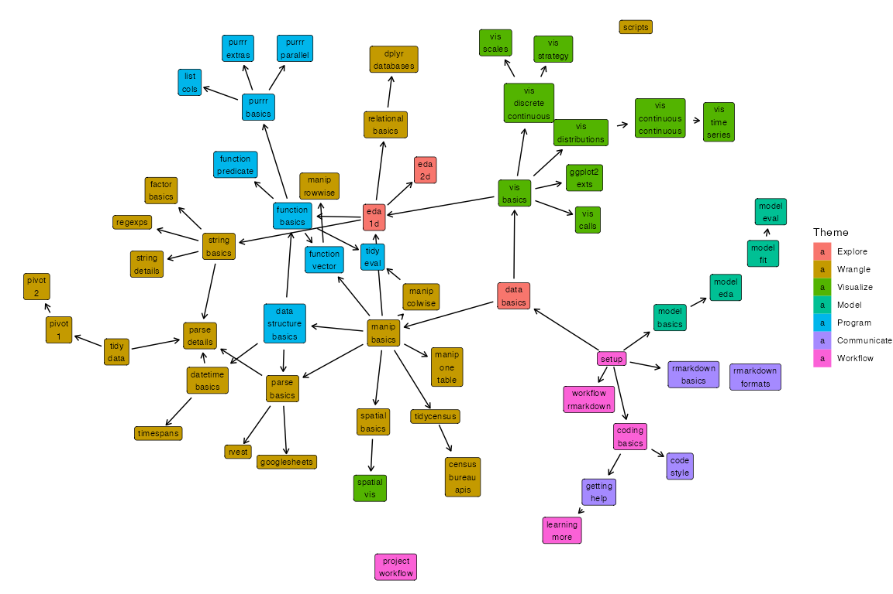

# Data Challenge Lab Curriculum

This repository is used to build this [site](https://dcl-docs.github.io/curriculum/), which contains the curriculum of readings for the Stanford [Data Challenge Lab](https://datalab.stanford.edu/challenge-lab).

## Overview

## Site structure and build process

If you would like to use or adapt this site for other purposes, the site structure and build process is described in this [document](site.md).
